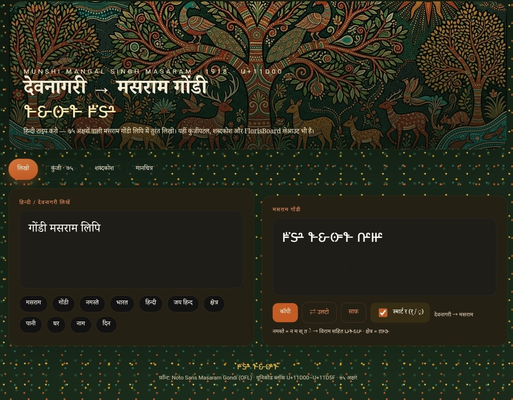

## Hindi → Masaram Gondi Converter


# देवनागरी → मसराम गोंडी

[](https://github.com/aimanage750/masaram-gondi/actions/workflows/test.yml)
[](https://github.com/aimanage750/masaram-gondi/actions/workflows/pages.yml)
[](LICENSE)

Munshi Mangal Singh Masaram (1918) ki lipi. Unicode block **U+11D00–U+11D5F** — **75 characters**.

**Live app:** [https://aimanage750.github.io/masaram-gondi/](https://aimanage750.github.io/masaram-gondi/)
**Source:** [github.com/aimanage750/masaram-gondi](https://github.com/aimanage750/masaram-gondi)

Hindi type karo — Masaram Gondi nikalta hai. Saath mein 75-key keyboard, FlorisBoard/HeliBoard layouts, Kotlin IME converter, aur Hindi–Gondi dictionary.

---

## Demo

```
मसराम     →  𑴤𑴫𑴦𑴱𑴤
गोंडी     →  𑴎𑴽𑵀𑴘𑴳
नमस्ते    →  𑴟𑴤𑴫𑵅𑴛𑴺
भारत      →  𑴣𑴱𑴦𑴛
हिन्दी    →  𑴬𑴲𑴟𑵅𑴝𑴳
जय हिन्द  →  𑴓𑴥 𑴬𑴲𑴟𑵅𑴝
क्षेत्र   →  𑴮𑴺𑴰
पानी      →  𑴠𑴱𑴟𑴳
घर        →  𑴏𑴦
कर्म      →  𑴌𑵆𑴤      (Repha)
क्रम      →  𑴌𑵇𑴤      (Ra-kara)
```

`नमस्ते` me virama `𑵅` zaroori hai (स् + त). Bina virama wala purana draft galat tha.

## Repo map

| Path | Kya hai |
|---|---|
| [`web/`](web/) | Live converter + 75-key keyboard + dictionary UI |
| [`florisboard/`](florisboard/) | Phonetic + InScript layouts (HeliBoard / FlorisBoard) |
| [`converter/python/`](converter/python/) | CLI + golden tests |
| [`converter/kotlin/`](converter/kotlin/) | Android IME live converter |
| [`converter/mapping.json`](converter/mapping.json) | Complete 1:1 map |
| [`dictionary/`](dictionary/) | 108 everyday Hindi ↔ Gondi words |

## Run locally

```bash
python3 converter/python/devanagari_to_masaram_gondi.py --test
python3 converter/python/devanagari_to_masaram_gondi.py "जय हिन्द"
python3 -m http.server 8765 --directory web --bind 127.0.0.1
```

## GitHub Pages

Repo: [aimanage750/masaram-gondi](https://github.com/aimanage750/masaram-gondi)

**Settings → Pages → Source: GitHub Actions**. Site:

`https://aimanage750.github.io/masaram-gondi/`

## Android

**Direct Gondi type:** `florisboard/layouts/characters/masaram_gondi.json` HeliBoard me import karo. Phone pe **Noto Sans Masaram Gondi** install karo.

**Hindi type → Gondi:** `converter/kotlin/DevanagariToMasaramGondi.kt`

```kotlin
val gondi = DevanagariToMasaramGondi.convert(hindiTyped)
ic.commitText(gondi, 1)
```

## Smart रा

| Hindi | Rule | Gondi |
|---|---|---|
| र् + C (कर्म) | cluster-initial → **Repha 𑵆** | 𑴌𑵆𑴤 |
| C + ्र (क्रम) | cluster-final → **Ra-kara 𑵇** | 𑴌𑵇𑴤 |
| त्र क्ष ज्ञ | precomposed | 𑴰 𑴮 𑴯 |
| ् conjunct | **Virama 𑵅** | हिन्दी |
| ् vowel-kill | **Halanta 𑵄** | word-final dead C |

## Dictionary

Har entry mein dono hain:

- `hindi_gondi` — Hindi shabd ka lipyantaran (पानी → 𑴠𑴱𑴟𑴳)
- `gondi_masaram` — Gondi *bhasha* ka shabd (पानी = ईर → 𑴃𑴦, घर = रोन → 𑴦𑴽𑴟)

Gondi ki kai boliyaan hain (Adilabad, Bastar, Mandla). Yeh prchalit roop hain, ek official standard nahi.

## Font & license

- Code: [MIT](LICENSE)
- Font `web/fonts/NotoSansMasaramGondi-Regular.ttf`: [SIL OFL 1.1](web/fonts/OFL.txt)

Bina is font ke boxes (□) dikhenge.
